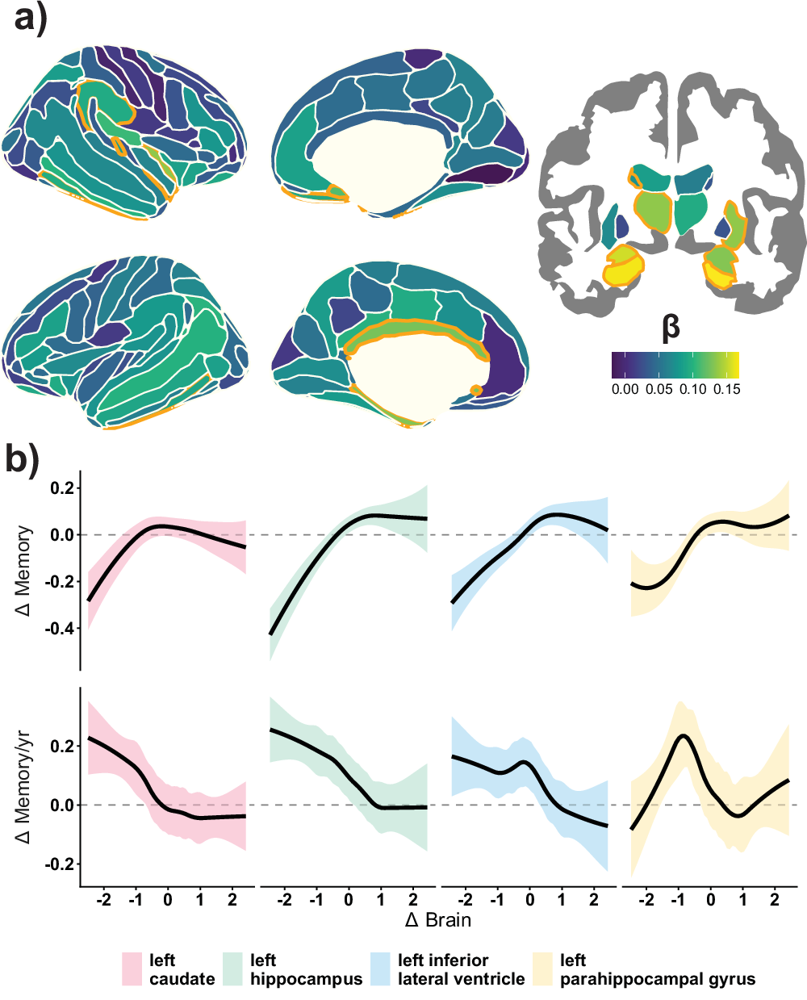
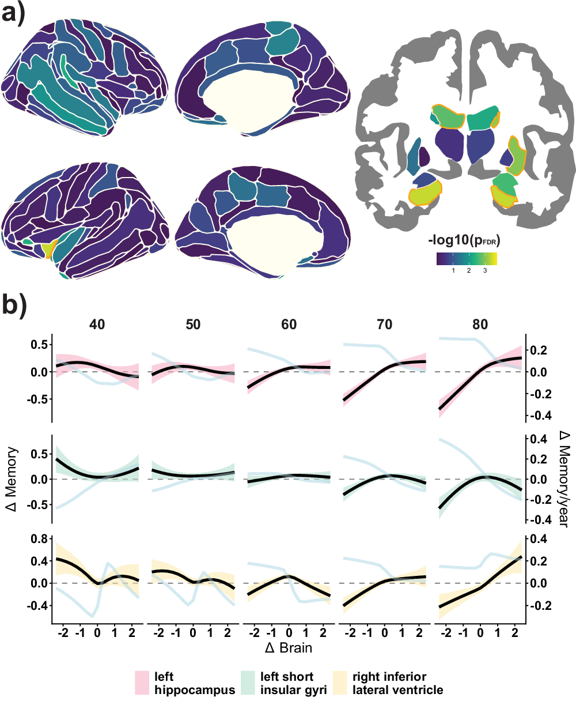
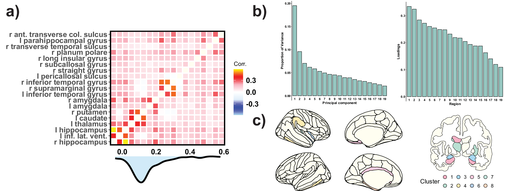

# Vulnerability to memory decline in aging revealed by a mega-analysis of structural brain change

**Authors**: Didac Vidal-Piñeiro, Øystein Sørensen, Marie Strømstad et al. (75 authors)
**Journal**: Nature Communications (2025)
**DOI**: [10.1038/s41467-025-66354-y](https://doi.org/10.1038/s41467-025-66354-y)
**License**: CC-BY-4.0 (Open Access)

## Quick Summary

[To be filled after reading]

## Relevance to Research

**Connection to**:
- [[../10.1038_s41467-025-58466-2/note|Wang et al. 2025]] - Spatial transcriptomics of aging brain
- [[../../research/databases/biogrid|BioGRID]] - Protein interaction networks
- [[../../data/genage/README|GenAge]] - Aging-related genes
- [[../../data/cellage/README|CellAge]] - Senescence markers

## Key Findings

[To be filled after reading]

## Methodology

[To be filled after reading]

## Figures

### Figure 1

### Figure 2

### Figure 3

### Figure 4

## Notes

[Add notes here]

## Related

- [[../INDEX|Papers Dashboard]]
- [[../../research/INDEX|Aging Research Dashboard]]

---

**PDF**: [paper.pdf](paper.pdf)
**Downloaded**: 2025-12-03
**Metadata**: [metadata.json](metadata.json)
