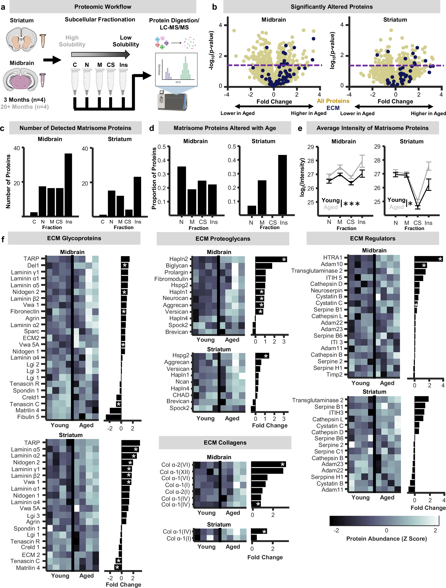
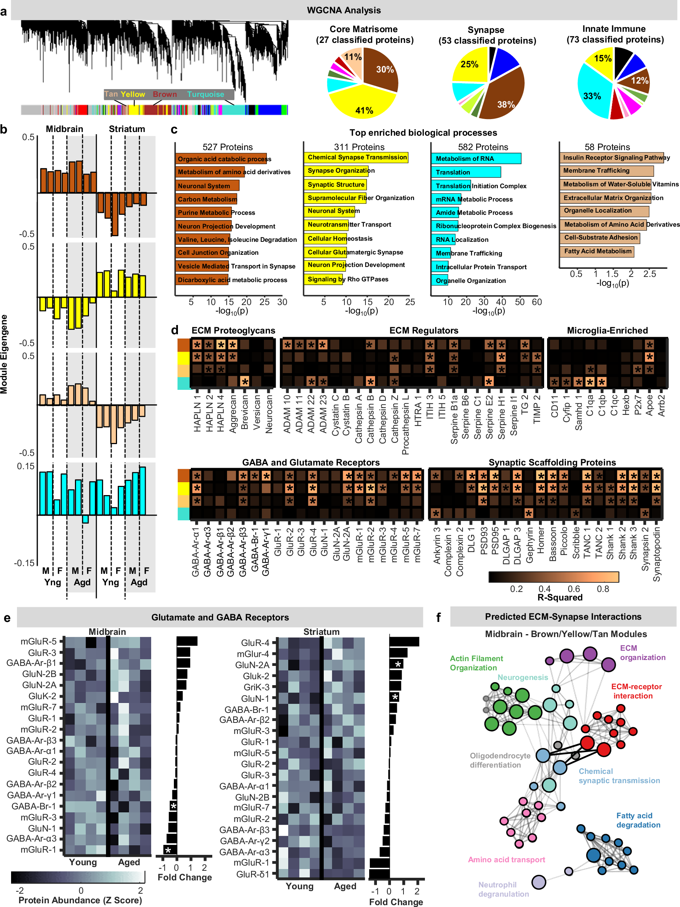
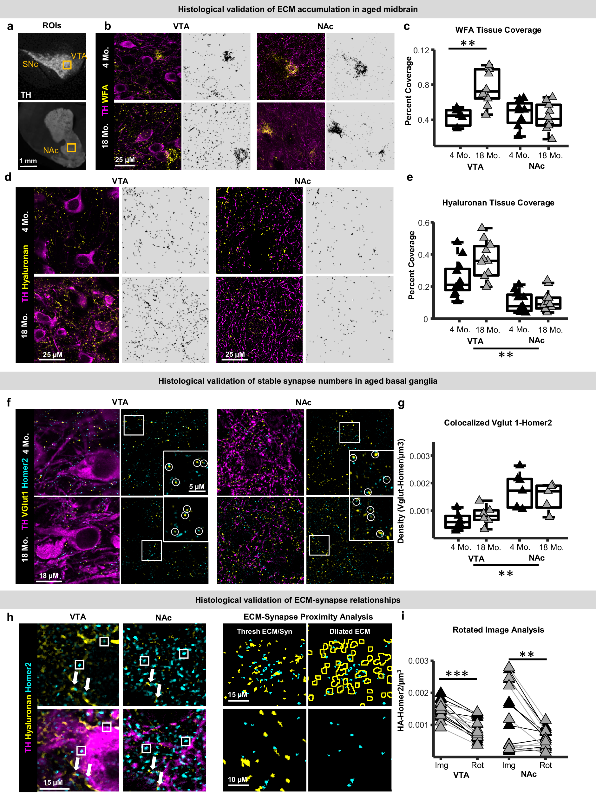
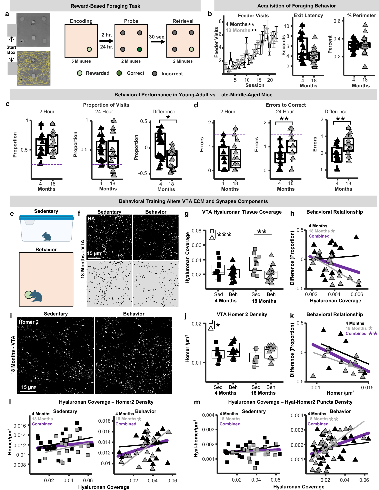
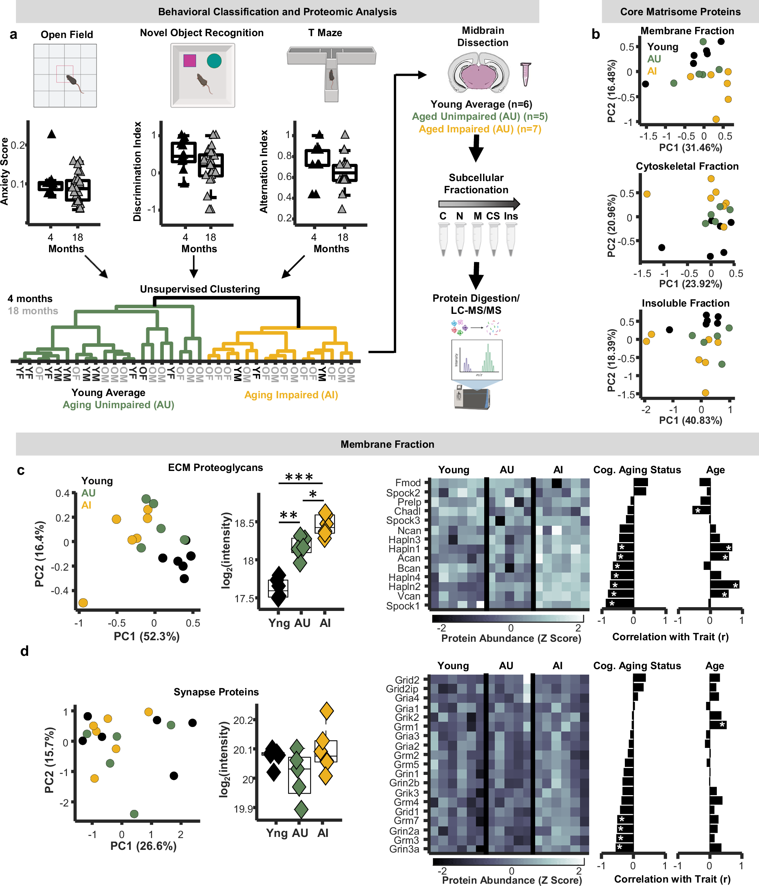

# Midbrain extracellular matrix and microglia are associated with cognition in aging mice

**Authors**: Gray DT, Gutierrez A, Jami-Alahmadi Y, et al. (9 authors)
**Journal**: Nature Communications (2025)
**DOI**: [10.1038/s41467-025-66434-z](https://doi.org/10.1038/s41467-025-66434-z)
**License**: CC-BY-4.0 (Open Access)

## Quick Summary

Investigates the role of midbrain extracellular matrix (ECM) and microglia in cognitive aging using mouse models.

## Relevance to Research

**Connection to**:
- [[../10.1038_s41467-025-58466-2/note|Wang et al. 2025]] - Spatial transcriptomics of aging brain
- [[../../research/databases/biogrid|BioGRID]] - Protein interactions in ECM and microglial pathways
- [[../../data/genage/README|GenAge]] - Aging-related genes in brain function
- [[../../data/cellage/README|CellAge]] - Senescence markers in aging microglia

## Key Findings

[To be filled after reading]

## Methodology

- Mouse model aging study
- Midbrain analysis
- ECM profiling
- Microglial characterization
- Cognitive assessment

## Figures

### Figure 1

### Figure 2

### Figure 3

### Figure 4

### Figure 5

### Figure 6

## Notes

**Research questions**:
- How does ECM remodeling contribute to cognitive decline?
- Role of microglia in brain aging?
- Connection to neuroinflammation?

## Related

- [[../INDEX|Papers Dashboard]]
- [[../../research/INDEX|Aging Research Dashboard]]

---

**PDF**: [paper.pdf](paper.pdf)
**Downloaded**: 2025-12-03
**Metadata**: [metadata.json](metadata.json)
