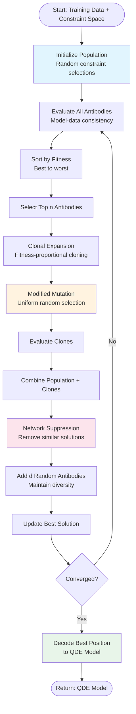
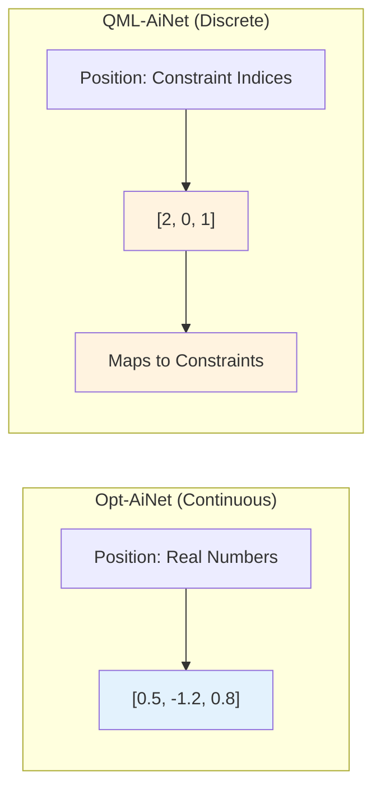
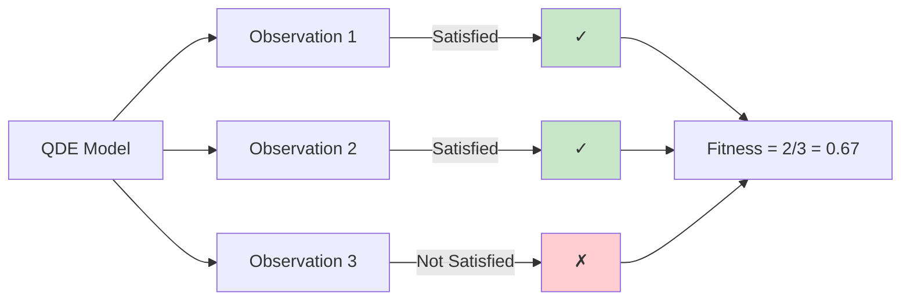
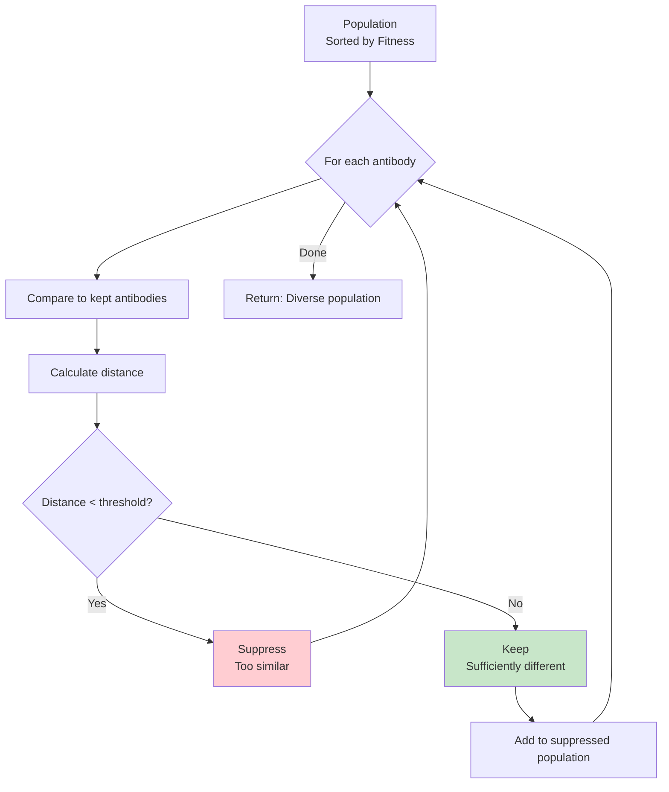
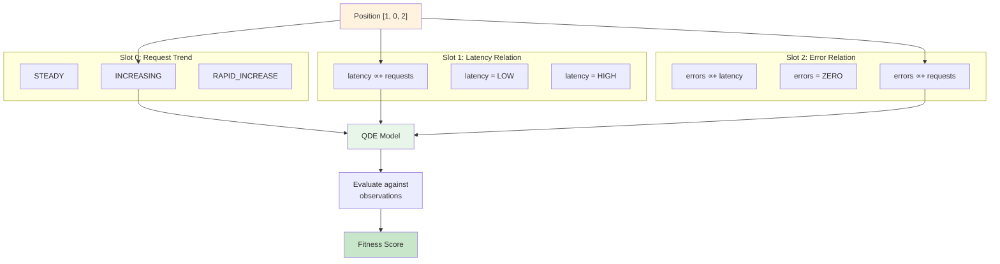
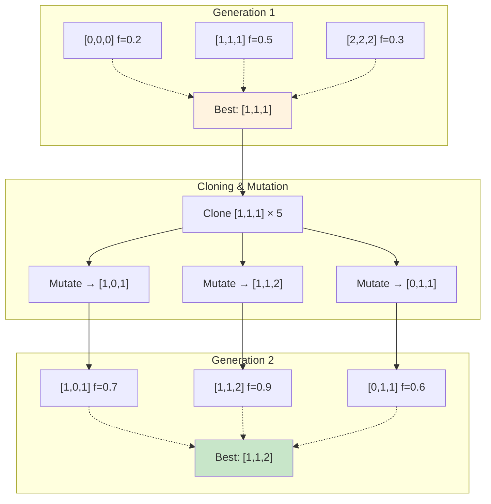

# QML-AiNet Algorithm Flow

Detailed algorithm flow for Qualitative Model Learning using Artificial Immune Networks.

## Algorithm Overview



## Key Differences from Opt-AiNet

### 1. Encoding



### 2. Mutation Operator

**Opt-AiNet (Gaussian)**:
```python
# Continuous space mutation
mutation_rate = alpha * e^(-beta * fitness)
mutated[i] = position[i] + N(0, mutation_rate)
```

**QML-AiNet (Uniform Random)**:
```python
# Discrete space mutation
for i in range(len(position)):
    if random() < mutation_rate:
        position[i] = random_choice(constraint_space[i])
```

### 3. Fitness Function

**Opt-AiNet**:
- Numeric objective function (e.g., minimize f(x))

**QML-AiNet**:
- Model-data consistency
- Fraction of observations satisfied by model



## Network Suppression

Eliminates antibodies that are too similar to higher-fitness solutions.



**Purpose**: Maintains diversity, prevents premature convergence

**Example**:
```
Original Population (10 antibodies):
  [0,1,2] fitness=0.9  ← Best
  [0,1,2] fitness=0.85 ← Suppressed (too similar to best)
  [0,1,3] fitness=0.8  ← Kept (different)
  [1,2,0] fitness=0.7  ← Kept (different)
  ...

Suppressed Population (6 antibodies):
  Only diverse solutions kept
```

## Constraint Space Example



**Search Space Size**: 3 × 3 × 3 = 27 combinations

## Evolution Process



Fitness improves: 0.5 → 0.7 → 0.9

## Complete QML-AiNet Pseudocode

```python
def qml_ainet(constraint_space, observations, parameters):
    # Initialize
    population = initialize_random(constraint_space, parameters.pop_size)
    evaluate_fitness(population, observations)

    for generation in range(parameters.max_gen):
        # Sort by fitness
        population.sort(key=lambda ab: ab.fitness, reverse=True)

        # Clone best antibodies
        clones = []
        for antibody in population[:parameters.n_select]:
            n_clones = round(parameters.clone_mult * antibody.fitness)
            for _ in range(n_clones):
                clone = antibody.clone()
                mutation_rate = exp(-parameters.beta * antibody.fitness)
                mutate_uniform(clone, constraint_space, mutation_rate)
                clones.append(clone)

        # Evaluate clones
        evaluate_fitness(clones, observations)

        # Network suppression
        combined = population + clones
        population = network_suppression(combined, parameters.threshold)

        # Add diversity
        for _ in range(parameters.d_random):
            population.append(initialize_random(constraint_space, 1)[0])

        # Update best
        best = max(population, key=lambda ab: ab.fitness)
        if converged(best, previous_best):
            break

    # Decode best solution
    model = decode_to_qde_model(best.position, constraint_space)
    return model
```

## Example Run

### Input
```python
variables = ["requests", "latency", "errors"]

constraint_space = [
    [STEADY, INCREASING, RAPID_INCREASE],
    [latency∝+requests, latency=LOW, latency=HIGH],
    [errors∝+latency, errors=ZERO, errors∝+requests]
]

observations = [
    {requests: STEADY, latency: LOW, errors: ZERO},
    {requests: RAPID_INCREASE, latency: HIGH, errors: HIGH}
]
```

### Evolution
```
Gen 0: Best=[0,1,1] Fitness=0.50 (1/2 observations)
Gen 5: Best=[1,0,0] Fitness=0.50
Gen 10: Best=[1,0,2] Fitness=1.00 (2/2 observations) ← FOUND!
```

### Output Model
```
QDE Model:
  Variables: requests, latency, errors
  Constraints:
    - d(requests)/dt = INCREASING
    - latency ∝+ requests
    - errors ∝+ requests
  Fitness: 1.0000
```

## Links

- [[../code-mirror/src/algorithms/qml_ainet|QML-AiNet Implementation]]
- [[../code-mirror/src/algorithms/opt_ainet|Opt-AiNet Base Class]]
- [[../../research/experiments/qml-ainet-validation-2025-11-30|Validation Results]]
- [[../../research/literature/pang-coghill-2015-qml-ainet|Original Paper]]

---

*Generated: 2025-11-30*
