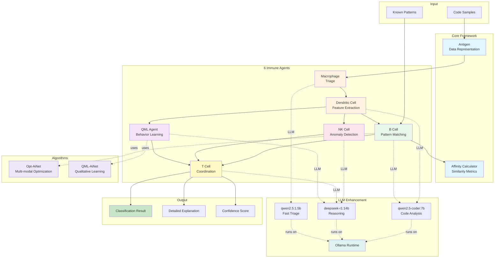
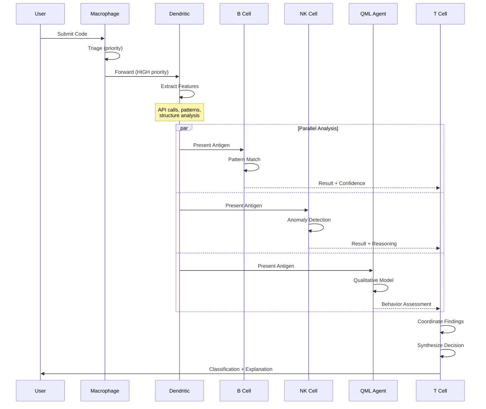

# IMMUNOS-MCP System Overview

High-level architecture showing all components and their relationships.

## System Architecture

## Component Descriptions

### Core Framework
- **Antigen**: Represents code samples to be analyzed
- **Affinity Calculator**: Measures similarity between antigens and patterns

### Immune Agents
1. **Macrophage** (qwen2.5:1.5b)
   - First responder
   - Quick triage: LOW/MEDIUM/HIGH priority
   - Routes to appropriate agents

2. **Dendritic Cell** (qwen2.5-coder:7b)
   - Feature extraction from code
   - Identifies API calls, patterns, structures
   - Presents antigens to other agents

3. **B Cell** (qwen2.5-coder:7b)
   - Pattern matching with clonal selection
   - Learns from training examples
   - Uses semantic similarity via LLM

4. **NK Cell** (deepseek-r1:14b)
   - Anomaly detection
   - Self vs non-self discrimination
   - Deep reasoning about suspicious behavior

5. **QML Agent** (deepseek-r1:14b)
   - Qualitative model learning
   - Behavioral pattern recognition
   - Constraint-based reasoning

6. **T Cell** (deepseek-r1:14b)
   - Coordinator of all agents
   - Synthesizes findings
   - Makes final classification decision

### Algorithms
- **Opt-AiNet**: Multi-modal optimization with network suppression
- **QML-AiNet**: Qualitative differential equation learning

### LLM Runtime
- **Ollama**: Local LLM inference (offline-capable)
- **Models**: 3 models totaling ~15GB

## Data Flow

## Links

- [[../code-mirror/src/core/antigen|Antigen Implementation]]
- [[../code-mirror/src/core/affinity|Affinity Calculator]]
- [[../code-mirror/src/agents/bcell_agent|B Cell Agent]]
- [[../code-mirror/src/agents/nk_cell_enhanced|NK Cell Agent]]
- [[../code-mirror/src/algorithms/opt_ainet|Opt-AiNet]]
- [[../code-mirror/src/algorithms/qml_ainet|QML-AiNet]]
- [[../code-mirror/examples/llm_enhanced_agents|LLM-Enhanced Agents]]

## References

- [[../../research/literature/de-castro-2002-opt-ainet|de Castro & Timmis (2002)]] - Opt-AiNet
- [[../../research/literature/pang-coghill-2015-qml-ainet|Pang & Coghill (2015)]] - QML-AiNet
- [[../docs/Model-Selection-By-Agent-Role|Model Selection Guide]]

---

*Generated: 2025-11-30*
