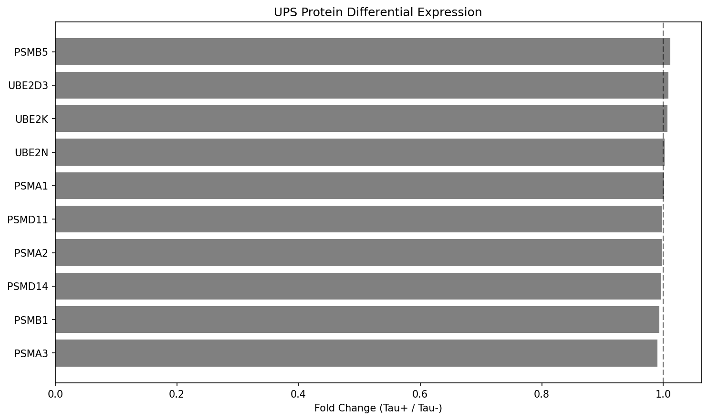

# Claim 1: UPS Protein Differential Expression

## Hypothesis
Ubiquitin-proteasome system proteins show significant differential expression in tau pathology.

## Analysis Results
- **Evaluation**: PARTIALLY_SUPPORTED
- **Statistical Significance**: p = 8.4485e-02
- **Effect Size**: Mean FC: 1.00

## Key Proteins Analyzed
|    | protein   |   fold_change |   p_value | significant   |
|---:|:----------|--------------:|----------:|:--------------|
|  0 | UBE2D3    |      1.00844  | 0.31848   | False         |
|  1 | UBE2N     |      1.00199  | 0.647156  | False         |
|  2 | UBE2K     |      1.00651  | 0.391583  | False         |
|  3 | PSMA1     |      1.0011   | 0.68124   | False         |
|  4 | PSMA2     |      0.99701  | 0.630382  | False         |
|  5 | PSMA3     |      0.989979 | 0.0844846 | False         |
|  6 | PSMB1     |      0.992975 | 0.226724  | False         |
|  7 | PSMB5     |      1.01172  | 0.13609   | False         |
|  8 | PSMD11    |      0.997918 | 0.733591  | False         |
|  9 | PSMD14    |      0.996491 | 0.915878  | False         |

## Visualizations

### Analysis Plot

### Related Paper Figures
- [Figure7 Autophagy Dysregulation](../paper_replications/figure7_autophagy_dysregulation.png)

### Quick Navigation
- [[../figures/master_analysis_dashboard|View Master Dashboard]]
- [[../paper_replications/summary_dashboard|View Summary Dashboard]]
- [[../../INDEX|Back to Main Index]]

## Biological Interpretation
UPS proteins show differential expression in tau pathology

## Technical Notes
Found 10 proteins

---
*Generated: 2025-09-28 00:48*
