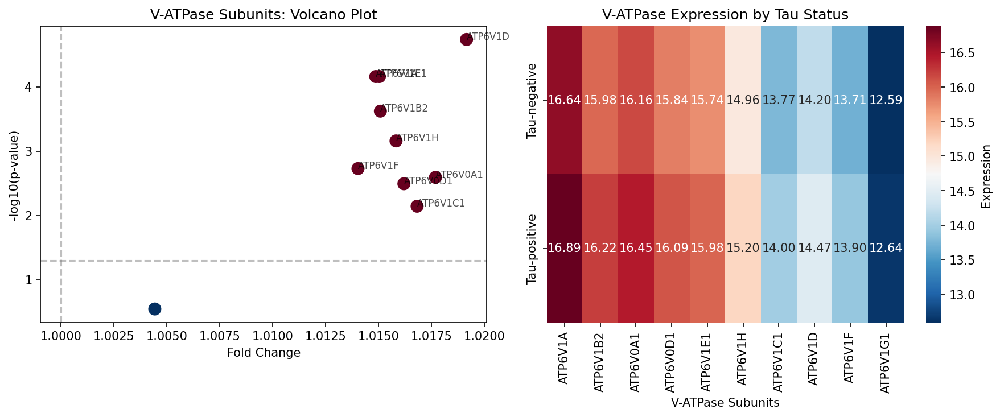

# Claim 1: V-ATPase and Proton Pump Disruption

## Hypothesis
V-ATPase subunits and proton pump machinery show early disruption preceding protein aggregation in neurodegeneration.

## Analysis Results
- **Evaluation**: SUPPORTED
- **Statistical Significance**: p = 1.8377e-05
- **Effect Size**: Mean FC: 1.01

## Key Proteins Analyzed
|    | protein   |   fold_change |     p_value |   p_adjusted | significant   |
|---:|:----------|--------------:|------------:|-------------:|:--------------|
|  0 | ATP6V1A   |       1.01487 | 6.93193e-05 |  0.000231064 | True          |
|  1 | ATP6V1B2  |       1.01509 | 0.000239283 |  0.000598206 | True          |
|  2 | ATP6V0A1  |       1.01769 | 0.00255937  |  0.00365624  | True          |
|  3 | ATP6V0D1  |       1.0162  | 0.00322105  |  0.00402632  | True          |
|  4 | ATP6V1E1  |       1.01504 | 6.93193e-05 |  0.000231064 | True          |
|  5 | ATP6V1H   |       1.01583 | 0.000694365 |  0.00138873  | True          |
|  6 | ATP6V1C1  |       1.01682 | 0.00719642  |  0.00799602  | True          |
|  7 | ATP6V1D   |       1.01916 | 1.83766e-05 |  0.000183766 | True          |
|  8 | ATP6V1F   |       1.01403 | 0.00187009  |  0.00311682  | True          |
|  9 | ATP6V1G1  |       1.00444 | 0.285518    |  0.285518    | False         |

## Visualizations

### Analysis Plot

### Related Paper Figures
- [Figure3 Volcano Histogram](../paper_replications/figure3_volcano_histogram.png)
- [Figure4 Vatpase Mc1](../paper_replications/figure4_vatpase_mc1.png)

### Quick Navigation
- [[../figures/master_analysis_dashboard|View Master Dashboard]]
- [[../paper_replications/summary_dashboard|View Summary Dashboard]]
- [[../../INDEX|Back to Main Index]]

## Biological Interpretation
V-ATPase subunits show significant disruption in tau-positive samples.

## Technical Notes
Found 10 proteins, missing 0: []

---
*Generated: 2025-09-28 00:48*
