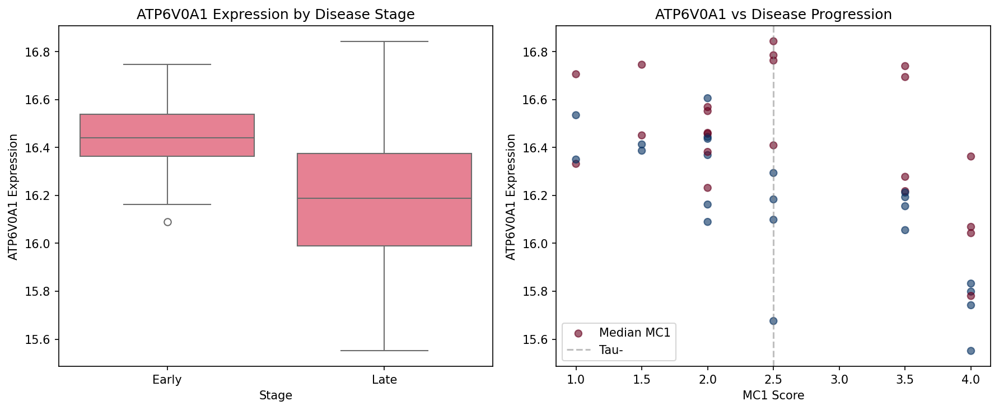

# Claim 2: ATP6V0A1 Upregulation in Early Tau Stages

## Hypothesis
ATP6V0A1 shows specific upregulation pattern at early tau accumulation stages, indicating compensatory response.

## Analysis Results
- **Evaluation**: REFUTED
- **Statistical Significance**: p = 9.9652e-01
- **Effect Size**: FC early→late: 0.99, FC tau: 1.02

## Key Proteins Analyzed
| Stage | Mean Expression | Fold Change | P-value |
|-------|----------------|-------------|----------|
| Early | 16.43 | - | - |
| Late | 16.20 | 0.99 | 0.9965 |

## Visualizations

### Analysis Plot

### Related Paper Figures
- [Figure5 Vatpase Pseudotime](../paper_replications/figure5_vatpase_pseudotime.png)
- [Figure6 11 Vatpase Mc1 Segmented](../paper_replications/figure6_11_vatpase_mc1_segmented.png)

### Quick Navigation
- [[../figures/master_analysis_dashboard|View Master Dashboard]]
- [[../paper_replications/summary_dashboard|View Summary Dashboard]]
- [[../../INDEX|Back to Main Index]]

## Biological Interpretation
ATP6V0A1 shows moderate changes in late disease stages.

## Technical Notes
Analysis based on MC1 staging and tau status

---
*Generated: 2025-09-28 00:48*
