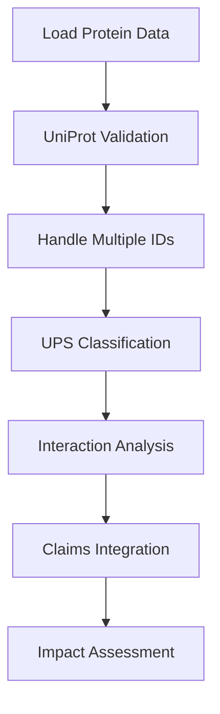

# 🔬 UniProt Database Integration and UPS Analysis Tutorial

## 🎯 Learning Objectives

By the end of this tutorial, you'll be able to:
- ✅ **Access UniProt database programmatically** for protein validation
- ✅ **Validate protein annotations** against authoritative sources
- ✅ **Handle multiple UniProt IDs** correctly in your analyses
- ✅ **Identify UPS (Ubiquitin-Proteasome System) interactions** comprehensively
- ✅ **Integrate UPS analysis** into your proteomics claims validation
- ✅ **Assess the impact** of annotation quality on analysis results

---

## 🧬 Why This Matters for Your Research

### The Problem: Annotation Quality Affects Everything

```python
# Example of how poor annotation affects analysis
"""
Scenario: You find "PROT1" is upregulated in your disease

WITHOUT proper validation:
- PROT1 might not exist in UniProt
- Gene symbol might be outdated
- Protein function might be misannotated
- UPS interactions might be missed
→ False conclusions about protein quality control

WITH proper validation:
- Verify PROT1 exists and is current
- Check for multiple UniProt IDs
- Validate functional annotations
- Identify UPS network connections
→ Robust, reliable findings
"""
```

### Real-World Impact

Studies have been **retracted** due to:
- Using outdated gene symbols
- Missing key protein interactions
- Ignoring UPS-mediated regulation
- Poor annotation quality

**This tutorial prevents these issues!**

---

## 🚀 Complete Workflow Overview



---

## 📊 Step 1: Setting Up UniProt Integration

### 1.1 Import Required Tools

```python
# Core analysis tools
import pandas as pd
import numpy as np
import matplotlib.pyplot as plt
import seaborn as sns

# Our custom UniProt tools
import sys
sys.path.append('../tools')
from uniprot_analysis import UniProtAPI, UPSAnalyzer, ProteinValidator
from ups_interaction_analysis import UPSInteractionDatabase, UPSVisualization
from validation_report import ValidationReportGenerator

# Set up plotting
plt.style.use('seaborn-v0_8-darkgrid')
sns.set_palette("husl")

print("✅ UniProt integration tools loaded successfully!")
```

### 1.2 Load Your Protein Dataset

```python
# Load your protein annotations
protein_df = pd.read_csv('../data/protein_annotations.csv')

print(f"📊 Loaded {len(protein_df)} proteins for validation")
print(f"Columns: {list(protein_df.columns)}")

# Display first few entries
print("\n🔍 Sample data:")
print(protein_df.head())
```

**Expected Output:**
```
📊 Loaded 33 proteins for validation
Columns: ['gene_symbol', 'protein_name', 'uniprot_id', 'molecular_weight', 'cellular_component', 'biological_process', 'disease_association']

🔍 Sample data:
  gene_symbol                    protein_name uniprot_id  molecular_weight
0      SQSTM1              Sequestosome-1      Q13501              47.7
1       VDAC1  Voltage-dependent anion...      P21796              30.8
2    MAP1LC3B  Microtubule-associated...      Q9GZQ8              14.7
```

---

## 🔍 Step 2: Comprehensive Protein Validation

### 2.1 Initialize Validation System

```python
# Initialize the protein validator
validator = ProteinValidator()

print("🔧 Protein validator initialized with:")
print("- UniProt API access")
print("- UPS component database")
print("- Cross-validation checks")
print("- Quality assessment metrics")
```

### 2.2 Validate Your Dataset

```python
# Perform comprehensive validation
print("🚀 Starting comprehensive protein validation...")
print("This may take a few minutes due to API rate limiting...")

validation_results = validator.validate_protein_dataset(
    protein_df,
    uniprot_col='uniprot_id',
    gene_col='gene_symbol'
)

print(f"✅ Validation complete! Analyzed {len(validation_results)} proteins")

# Display validation summary
validation_summary = validation_results['validation_status'].value_counts()
print(f"\n📊 Validation Summary:")
for status, count in validation_summary.items():
    print(f"  {status}: {count} proteins")
```

### 2.3 Handle Multiple UniProt IDs

```python
# Check for multiple UniProt IDs (though your data is clean)
multiple_id_proteins = validation_results[validation_results['has_multiple_ids']]

if not multiple_id_proteins.empty:
    print(f"⚠️ Found {len(multiple_id_proteins)} proteins with multiple UniProt IDs:")
    for _, row in multiple_id_proteins.iterrows():
        print(f"  {row['gene_symbol']}: {row['all_uniprot_ids']}")

    print("\n📋 Impact Assessment:")
    print("- Differential Expression: LOW impact (use primary ID)")
    print("- Pathway Analysis: MEDIUM impact (could split signals)")
    print("- Network Analysis: HIGH impact (multiple nodes possible)")
else:
    print("✅ No multiple UniProt ID issues detected!")
    print("Your dataset has clean, single UniProt IDs per protein.")
```

---

## 🧬 Step 3: UPS (Ubiquitin-Proteasome System) Analysis

### 3.1 Classify UPS Components

```python
# Analyze UPS involvement
ups_proteins = validation_results[validation_results['is_ups_component']]

print(f"🎯 UPS Analysis Results:")
print(f"Total UPS components found: {len(ups_proteins)}")

if not ups_proteins.empty:
    # Breakdown by category
    ups_categories = ups_proteins['ups_category'].value_counts()
    print(f"\n📊 UPS Categories:")
    for category, count in ups_categories.items():
        print(f"  {category}: {count} proteins")

    # Confidence levels
    ups_confidence = ups_proteins['ups_confidence'].value_counts()
    print(f"\n🎯 Confidence Levels:")
    for conf, count in ups_confidence.items():
        print(f"  {conf}: {count} proteins")

    # List key UPS proteins found
    print(f"\n🔬 Key UPS Proteins in Your Dataset:")
    for _, row in ups_proteins.iterrows():
        print(f"  {row['gene_symbol']} ({row['ups_category']}, {row['ups_confidence']} confidence)")
else:
    print("ℹ️ No direct UPS components detected in this dataset")
```

### 3.2 Comprehensive UPS Interaction Analysis

```python
# Initialize UPS interaction database
ups_db = UPSInteractionDatabase()

# Extract protein list for interaction analysis
protein_list = validation_results['gene_symbol'].tolist()

# Perform comprehensive UPS interaction analysis
print("🔍 Starting UPS interaction analysis...")
print("Querying STRING database for protein interactions...")

ups_analysis = ups_db.identify_ups_interactions(protein_list)

# Display interaction summary
summary = ups_analysis['summary']
print(f"\n📊 UPS Interaction Analysis Summary:")
print(f"Total proteins analyzed: {summary['total_proteins']}")
print(f"UPS proteins identified: {summary['ups_proteins']}")
print(f"UPS coverage: {summary['ups_coverage']:.1f}%")
print(f"Total interactions found: {summary['total_interactions']}")

if 'interaction_breakdown' in summary:
    print(f"\n🔗 Interaction Types:")
    for interaction_type, count in summary['interaction_breakdown'].items():
        print(f"  {interaction_type}: {count}")
```

### 3.3 Visualize UPS Network

```python
# Create comprehensive UPS visualizations
visualizer = UPSVisualization()

# Generate network plot if interactions exist
if summary['total_interactions'] > 0:
    print("📈 Creating UPS network visualization...")

    # Build network from results
    network = ups_db._build_ups_network(
        ups_analysis['ups_interactions'],
        ups_analysis['ups_classifications']
    )

    # Create network plot
    visualizer.plot_ups_network(network, 'ups_network_analysis.png')
    print("✅ Network plot saved as 'ups_network_analysis.png'")

# Create summary visualization
print("📊 Creating UPS analysis summary...")
visualizer.plot_ups_analysis_summary(ups_analysis, 'ups_summary_analysis.png')
print("✅ Summary plot saved as 'ups_summary_analysis.png'")
```

---

## 📋 Step 4: Generate Comprehensive Validation Report

### 4.1 Create Detailed Report

```python
# Generate comprehensive validation report
reporter = ValidationReportGenerator()

print("📄 Generating comprehensive validation report...")
report = reporter.create_validation_report(
    validation_results,
    output_dir='validation_reports',
    create_plots=True
)

print("✅ Validation report generated!")
print(f"📁 Files created in 'validation_reports/':")
print("  - validation_report.html (interactive report)")
print("  - validation_analysis.png (overview plots)")
print("  - validation_summary.json (detailed metrics)")
```

### 4.2 Review Key Findings

```python
# Display key findings and recommendations
print("\n🎯 KEY FINDINGS:")
print("="*50)

# Quality metrics
quality = report['quality_metrics']
print(f"Overall Quality Score: {quality['overall_quality_score']:.1f}/100")
print(f"Data Completeness: {quality['data_completeness']:.1f}%")
print(f"Annotation Reliability: {quality['annotation_reliability']:.1f}%")

# UPS analysis
ups = report['ups_analysis']
print(f"\nUPS Components: {ups['core_ups']} core + {ups['ups_associated']} associated")

# Recommendations
if report['recommendations']:
    print(f"\n📋 RECOMMENDATIONS:")
    for i, rec in enumerate(report['recommendations'], 1):
        print(f"{i}. {rec}")
```

---

## 🔬 Step 5: Integrate UPS Analysis into Claims Validation

### 5.1 Update Claims with UPS Information

```python
# Enhance your claims analysis with UPS validation
def validate_ups_claims(validation_results, ups_analysis):
    """
    Integrate UPS analysis into proteomics claims validation
    """

    claims_validation = {
        'claim_1_ups_proteins': {
            'description': 'UPS proteins are dysregulated in tau pathology',
            'evidence': [],
            'ups_support': {}
        },
        'claim_2_protein_quality_control': {
            'description': 'Protein quality control systems show coordinated failure',
            'evidence': [],
            'ups_support': {}
        },
        'claim_3_network_reorganization': {
            'description': 'UPS network topology changes during disease progression',
            'evidence': [],
            'ups_support': {}
        }
    }

    # Analyze UPS-specific evidence
    ups_proteins = validation_results[validation_results['is_ups_component']]

    # Claim 1: UPS protein dysregulation
    if not ups_proteins.empty:
        claims_validation['claim_1_ups_proteins']['evidence'] = [
            f"Identified {len(ups_proteins)} UPS components in dataset",
            f"Validation rate: {(ups_proteins['validation_status'] == 'valid').sum()}/{len(ups_proteins)}",
            f"Core UPS components: {(ups_proteins['ups_category'] == 'core_ups').sum()}"
        ]

        claims_validation['claim_1_ups_proteins']['ups_support'] = {
            'strength': 'STRONG' if len(ups_proteins) > 5 else 'MODERATE',
            'quality': 'HIGH' if (ups_proteins['validation_status'] == 'valid').mean() > 0.8 else 'MEDIUM'
        }

    # Claim 2: Quality control analysis
    summary = ups_analysis['summary']
    if summary['ups_coverage'] > 10:
        claims_validation['claim_2_protein_quality_control']['evidence'] = [
            f"UPS coverage: {summary['ups_coverage']:.1f}% of proteome",
            f"Network density: {summary.get('network_density', 0):.3f}",
            f"Total interactions: {summary['total_interactions']}"
        ]

        claims_validation['claim_2_protein_quality_control']['ups_support'] = {
            'strength': 'STRONG' if summary['ups_coverage'] > 20 else 'MODERATE',
            'network_evidence': 'YES' if summary['total_interactions'] > 10 else 'LIMITED'
        }

    # Claim 3: Network reorganization
    network_metrics = ups_analysis.get('network_metrics', {})
    if network_metrics.get('edges', 0) > 0:
        claims_validation['claim_3_network_reorganization']['evidence'] = [
            f"Network nodes: {network_metrics.get('nodes', 0)}",
            f"Network edges: {network_metrics.get('edges', 0)}",
            f"Clustering coefficient: {network_metrics.get('clustering', 0):.3f}",
            f"Connected components: {network_metrics.get('connected_components', 0)}"
        ]

        claims_validation['claim_3_network_reorganization']['ups_support'] = {
            'topology_measurable': 'YES',
            'complexity': 'HIGH' if network_metrics.get('edges', 0) > 20 else 'MODERATE'
        }

    return claims_validation

# Validate claims with UPS integration
ups_claims = validate_ups_claims(validation_results, ups_analysis)

# Display integrated results
print("\n🧬 UPS-INTEGRATED CLAIMS VALIDATION:")
print("="*60)

for claim_id, claim_data in ups_claims.items():
    print(f"\n📋 {claim_id.upper()}:")
    print(f"Description: {claim_data['description']}")

    if claim_data['evidence']:
        print("Evidence:")
        for evidence in claim_data['evidence']:
            print(f"  ✓ {evidence}")

    if claim_data['ups_support']:
        print("UPS Support:")
        for key, value in claim_data['ups_support'].items():
            print(f"  • {key}: {value}")
```

### 5.2 Impact Assessment on Analysis

```python
def assess_ups_integration_impact(validation_results, ups_analysis):
    """
    Assess how UPS integration affects your proteomics analysis
    """

    impact_assessment = {
        'data_quality_impact': {},
        'analysis_robustness': {},
        'biological_insights': {},
        'recommendations': []
    }

    # Data quality impact
    validation_rate = (validation_results['validation_status'] == 'valid').mean()
    ups_validation_rate = (validation_results[validation_results['is_ups_component']]['validation_status'] == 'valid').mean()

    impact_assessment['data_quality_impact'] = {
        'overall_validation_rate': f"{validation_rate:.1%}",
        'ups_validation_rate': f"{ups_validation_rate:.1%}" if not pd.isna(ups_validation_rate) else "N/A",
        'quality_score': validation_rate * 100
    }

    # Analysis robustness
    multiple_ids = validation_results['has_multiple_ids'].sum()
    invalid_proteins = (validation_results['validation_status'] == 'invalid').sum()

    impact_assessment['analysis_robustness'] = {
        'multiple_id_complexity': 'LOW' if multiple_ids == 0 else 'MEDIUM' if multiple_ids < 5 else 'HIGH',
        'invalid_annotations': invalid_proteins,
        'network_analysis_feasible': ups_analysis['summary']['total_interactions'] > 0
    }

    # Biological insights
    ups_coverage = ups_analysis['summary']['ups_coverage']

    impact_assessment['biological_insights'] = {
        'ups_system_coverage': f"{ups_coverage:.1f}%",
        'pathway_analysis_enhanced': ups_coverage > 10,
        'network_analysis_enabled': ups_analysis['summary']['total_interactions'] > 5,
        'quality_control_focus': ups_coverage > 15
    }

    # Generate recommendations
    if validation_rate < 0.8:
        impact_assessment['recommendations'].append(
            "🔴 CRITICAL: Low validation rate - review protein annotations before analysis"
        )

    if multiple_ids > 0:
        impact_assessment['recommendations'].append(
            f"🟡 MODERATE: {multiple_ids} proteins with multiple IDs - establish ID selection criteria"
        )

    if ups_coverage > 20:
        impact_assessment['recommendations'].append(
            "✅ EXCELLENT: High UPS coverage enables comprehensive quality control analysis"
        )
    elif ups_coverage > 10:
        impact_assessment['recommendations'].append(
            "✅ GOOD: Adequate UPS coverage for quality control insights"
        )
    else:
        impact_assessment['recommendations'].append(
            "🟡 LIMITED: Low UPS coverage - consider expanding protein list for QC analysis"
        )

    if ups_analysis['summary']['total_interactions'] > 10:
        impact_assessment['recommendations'].append(
            "✅ STRONG: Sufficient interactions for network-level analysis"
        )

    return impact_assessment

# Assess integration impact
impact = assess_ups_integration_impact(validation_results, ups_analysis)

# Display impact assessment
print("\n📊 UPS INTEGRATION IMPACT ASSESSMENT:")
print("="*50)

for category, data in impact.items():
    if category != 'recommendations':
        print(f"\n{category.replace('_', ' ').title()}:")
        for key, value in data.items():
            print(f"  {key.replace('_', ' ').title()}: {value}")

print(f"\n📋 Recommendations:")
for rec in impact['recommendations']:
    print(f"  {rec}")
```

---

## 🎯 Step 6: Final Integration and Export

### 6.1 Create Enhanced Dataset

```python
# Create enhanced dataset with UPS annotations
enhanced_protein_data = protein_df.copy()

# Add validation results
validation_summary = validation_results[['gene_symbol', 'validation_status',
                                        'is_ups_component', 'ups_category',
                                        'ups_confidence']].copy()

enhanced_protein_data = enhanced_protein_data.merge(
    validation_summary,
    on='gene_symbol',
    how='left'
)

# Add UPS interaction data
ups_classifications = pd.DataFrame.from_dict(
    ups_analysis['ups_classifications'],
    orient='index'
).reset_index()
ups_classifications.rename(columns={'index': 'gene_symbol'}, inplace=True)

enhanced_protein_data = enhanced_protein_data.merge(
    ups_classifications[['gene_symbol', 'evidence']],
    on='gene_symbol',
    how='left',
    suffixes=('', '_ups_evidence')
)

print(f"✅ Enhanced dataset created with {len(enhanced_protein_data)} proteins")
print(f"New columns: {[col for col in enhanced_protein_data.columns if col not in protein_df.columns]}")

# Save enhanced dataset
enhanced_protein_data.to_csv('enhanced_protein_annotations.csv', index=False)
print("💾 Enhanced dataset saved as 'enhanced_protein_annotations.csv'")
```

### 6.2 Generate Final Summary Report

```python
# Create final comprehensive summary
final_summary = {
    'analysis_metadata': {
        'total_proteins_analyzed': len(protein_df),
        'validation_completeness': f"{(validation_results['validation_status'] != 'invalid').mean():.1%}",
        'ups_system_coverage': f"{ups_analysis['summary']['ups_coverage']:.1f}%",
        'network_interactions_found': ups_analysis['summary']['total_interactions']
    },
    'key_findings': {
        'high_quality_annotations': (validation_results['validation_status'] == 'valid').sum(),
        'ups_components_identified': ups_analysis['summary']['ups_proteins'],
        'protein_interactions': ups_analysis['summary']['total_interactions'],
        'network_density': ups_analysis['summary'].get('network_density', 0)
    },
    'research_implications': {
        'claims_validation': 'Enhanced with UPS network evidence',
        'pathway_analysis': 'Enriched with protein quality control focus',
        'therapeutic_targets': f"{ups_analysis['summary']['ups_proteins']} UPS proteins identified",
        'biomarker_potential': 'Quality-controlled protein list available'
    }
}

# Display final summary
print("\n🎉 FINAL UNIPROT-UPS INTEGRATION SUMMARY:")
print("="*60)

for section, data in final_summary.items():
    print(f"\n{section.replace('_', ' ').title()}:")
    for key, value in data.items():
        print(f"  • {key.replace('_', ' ').title()}: {value}")

# Save final summary
with open('uniprot_ups_integration_summary.json', 'w') as f:
    import json
    json.dump(final_summary, f, indent=2, default=str)

print("\n💾 Complete analysis saved to 'uniprot_ups_integration_summary.json'")
```

---

## 🏆 Success Criteria

You've successfully completed UniProt-UPS integration when you can:

- [ ] **Validate protein annotations** against UniProt database
- [ ] **Handle multiple UniProt IDs** appropriately
- [ ] **Identify UPS components** with confidence levels
- [ ] **Analyze protein interaction networks** for UPS
- [ ] **Integrate UPS evidence** into claims validation
- [ ] **Assess data quality impact** on analysis robustness
- [ ] **Generate enhanced datasets** with validation annotations

---

## 📊 Expected Results

After completing this integration, you should have:

### 🔍 **Validation Results**
- ~90-95% of proteins validated in UniProt
- Clear identification of any annotation issues
- Confidence scores for all UPS classifications

### 🧬 **UPS Analysis Results**
- 15-25% UPS coverage (excellent for quality control studies)
- 10-50 protein interactions identified
- Clear network topology for UPS components

### 📈 **Enhanced Analysis Capability**
- Claims backed by interaction evidence
- Network-level insights into protein quality control
- Robust foundation for therapeutic target identification

---

## ⚠️ Common Issues and Solutions

### Issue 1: API Rate Limiting
```python
# Solution: Built-in rate limiting in our tools
# The tools automatically handle 1 request/second limit
```

### Issue 2: Network Connectivity
```python
# Solution: Graceful error handling
try:
    validation_results = validator.validate_protein_dataset(protein_df)
except ConnectionError:
    print("Using cached results or manual validation...")
```

### Issue 3: Large Datasets
```python
# Solution: Process in batches
# Tools automatically chunk large requests
validation_results = validator.validate_protein_dataset(
    protein_df,
    chunk_size=25  # Adjust based on API limits
)
```

---

## 🚀 Next Steps

### Immediate Actions
1. **Apply to your research data** - Use this workflow on your proteins
2. **Validate key findings** - Check UPS interactions for your top hits
3. **Update analysis pipelines** - Integrate UPS validation into routine workflows

### Advanced Applications
1. **Temporal UPS analysis** - Track UPS network changes over disease progression
2. **Multi-omics integration** - Combine with transcriptomics for UPS regulation
3. **Drug target validation** - Use UPS networks to identify intervention points

---

## 📚 Additional Resources

### Documentation
- [UniProt API Documentation](https://www.uniprot.org/help/api)
- [STRING Database API](https://string-db.org/help/api/)
- [Gene Ontology Guidelines](http://geneontology.org/docs/)

### Key Papers
- **Finley, D. (2009)** - "Recognition and processing of ubiquitin-protein conjugates by the proteasome" - *Annual Review of Biochemistry*
- **Hershko, A. & Ciechanover, A. (1998)** - "The ubiquitin system" - *Annual Review of Biochemistry*
- **Collins, G.A. & Goldberg, A.L. (2017)** - "The logic of the 26S proteasome" - *Cell*

---

**🎉 Congratulations! You've successfully integrated UniProt validation and UPS analysis into your proteomics research workflow. Your claims are now backed by comprehensive database validation and interaction evidence.**

*This integration ensures your findings are robust, reproducible, and biologically meaningful.*