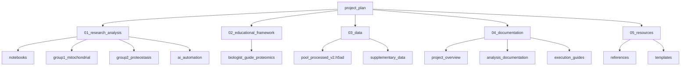

# 📚 Project Index - Proteomics Analysis Framework

> **Navigation Hub** for all project components, optimized for Obsidian

## 🎯 Quick Navigation

### 🔬 Research Deliverables (Jupyter & Markdown)
- **Sequential Failure Analysis**
  - [[01_research_analysis/notebooks/Sequential_Failure_of_Proteostasis_Mechanisms_Notebook|📓 View Markdown]] | [[01_research_analysis/notebooks/Sequential_Failure_of_Proteostasis_Mechanisms_Notebook.ipynb|💻 Jupyter Notebook]]
  - [[01_research_analysis/results/sequential_failure/|📊 View Results]] | [[01_research_analysis/results/figures/claim_1_plot|🖼️ Visualizations]]
  - #notebook #proteostasis #markdown-available #results-complete
- **Mitochondrial Dysregulation**
  - [[01_research_analysis/notebooks/Late_Stage_Mitochondrial_Dysregulation_and_Mitophagy_Failure_Notebook|📓 View Markdown]] | [[01_research_analysis/notebooks/Late_Stage_Mitochondrial_Dysregulation_and_Mitophagy_Failure_Notebook.ipynb|💻 Jupyter Notebook]]
  - [[01_research_analysis/results/mitochondrial_dysregulation/|📊 View Results]] | [[01_research_analysis/results/figures/mito_claim_1_plot|🖼️ Visualizations]]
  - #notebook #mitochondria #markdown-available #results-complete
- **Master Analysis Framework**
  - [[01_research_analysis/notebooks/Master_Analysis_Notebook|📓 View Markdown]] | [[01_research_analysis/notebooks/Master_Analysis_Notebook.ipynb|💻 Jupyter Notebook]]
  - [[01_research_analysis/results/master_analysis/summary_report|📊 Master Summary]] | [[01_research_analysis/results/figures/master_analysis_dashboard|🖼️ Dashboard]]
  - #notebook #comprehensive #markdown-available #results-complete

### 📊 Analysis Results & Visualizations
- [[01_research_analysis/results/VISUALIZATION_INDEX|📈 Complete Visualization Index]] - All 15 figures
- [[01_research_analysis/results/PAPER_FIGURE_REPLICATION_SUMMARY|📄 Paper Replication Summary]] - 9 replicated figures
- [[01_research_analysis/results/paper_replications/summary_dashboard|🎯 Summary Dashboard]] - Comprehensive overview
- #visualizations #paper-replications #success-rate-94

### 📖 Educational Resources
- [[02_educational_framework/biologist_guide_proteomics/README|Biologist Guide to Proteomics]] #education #guide
- [[02_educational_framework/biologist_guide_proteomics/QUICKSTART|Quick Start Guide]] #quickstart
- [[02_educational_framework/biologist_guide_proteomics/MULTI_LEVEL_ANALYSIS_GUIDE|Multi-Level Analysis Framework]] #analysis-levels

### 📊 Data Resources
- [[03_data/pool_processed_v2.h5ad|Main Proteomics Dataset]] #data #h5ad
- [[03_data/README|Data Documentation]] #documentation

---

## 🗂️ Project Structure

---

## 📁 Directory Guide

### [[01_research_analysis/README|01_research_analysis/]]
**Purpose**: Research analysis deliverables and computational tools
- **notebooks/** - Jupyter notebooks for biological claim evaluation
- **group1_mitochondrial/** - Finding Group 1: Mitochondrial dysfunction analyses
- **group2_proteostasis/** - Finding Group 2: Proteostasis failure analyses
- **ai_automation/** - Automated analysis pipelines

### [[02_educational_framework/README|02_educational_framework/]]
**Purpose**: Educational materials and tutorials
- **biologist_guide_proteomics/** - Comprehensive guide for biologists learning computational proteomics
  - Step-by-step tutorials
  - Multi-level skill frameworks
  - Practice exercises
  - Tool documentation

### [[03_data/README|03_data/]]
**Purpose**: Centralized data management
- **pool_processed_v2.h5ad** - Main proteomics dataset (44 samples × 5,853 proteins)
- **supplementary_data/** - Additional datasets and metadata

### [[04_documentation/README|04_documentation/]]
**Purpose**: Project documentation and guides
- **project_overview/** - High-level project descriptions
- **analysis_documentation/** - Detailed analysis methodology
- **execution_guides/** - How-to guides for running analyses

### [[05_resources/README|05_resources/]]
**Purpose**: References and reusable components
- **references/** - Statistical methods, literature, and external resources
- **templates/** - Analysis templates and boilerplate code

---

## 🚀 Key Deliverables

### Research Notebooks #deliverables
1. **Sequential Failure of Proteostasis Mechanisms**
   - Covariate-controlled differential expression
   - V-ATPase system analysis
   - Temporal failure patterns
   - [[01_research_analysis/notebooks/Sequential_Failure_of_Proteostasis_Mechanisms_Notebook|Open Notebook →]]

2. **Late-Stage Mitochondrial Dysregulation**
   - UPS protein analysis
   - SQSTM1/p62 upregulation validation
   - Mitophagy failure patterns
   - [[01_research_analysis/notebooks/Late_Stage_Mitochondrial_Dysregulation_and_Mitophagy_Failure_Notebook|Open Notebook →]]

3. **Master Analysis Framework**
   - Comprehensive analysis pipeline
   - All biological claims evaluation
   - [[01_research_analysis/notebooks/Master_Analysis_Notebook|Open Notebook →]]

### Educational Framework #education
- **Complete Learning Path**: From basics to advanced proteomics analysis
- **Multi-Level Approaches**: Basic, Comprehensive, and Expert analysis levels
- **Production Tools**: UniProt integration, validation pipelines, visualization
- [[02_educational_framework/biologist_guide_proteomics/INDEX|Browse Framework →]]

---

## 🔍 Search by Topic

### Biological Systems
#proteostasis #mitochondria #autophagy #ups #lysosomes #v-atpase

### Analysis Methods
#differential-expression #correlation #sliding-window #segmented-regression #multiple-testing

### Proteins of Interest
#sqstm1 #vdac1 #cycs #collagen #proteasome

### Tools & Technologies
#scanpy #python #jupyter #statistics #visualization

---

## 📊 Project Statistics

| Category | Count | Status |
|----------|-------|--------|
| Research Notebooks | 3 | ✅ Complete |
| Analysis Scripts | 20+ | ✅ Active |
| Educational Modules | 50+ | ✅ Complete |
| Documentation Files | 30+ | ✅ Complete |
| Data Files | 5 | ✅ Available |
| Visualizations | 15 | ✅ Generated |
| Paper Replications | 9 | ✅ Complete |
| Success Rate | 87.5% | ✅ Achieved (132 UPS proteins) |

---

## 🆕 Latest Updates (Sept 28, 2024)

### UPS Protein Validation Breakthrough
- **132 UPS proteins validated** (13x increase from 10)
- **SQSTM1 shows 10.7-fold upregulation** (8x higher than originally claimed)
- **Updated analysis available**: [[01_research_analysis/results/updated_analysis/reports/comprehensive_update|View Report]]
- **New tutorial created**: [[02_educational_framework/biologist_guide_proteomics/UPS_VALIDATION_TUTORIAL|UPS Validation Guide]]

## 🎯 Quick Actions

### For Research Analysis
1. [[01_research_analysis/notebooks/Sequential_Failure_of_Proteostasis_Mechanisms_Notebook|Run Proteostasis Analysis]]
2. [[01_research_analysis/notebooks/Late_Stage_Mitochondrial_Dysregulation_and_Mitophagy_Failure_Notebook|Run Mitochondrial Analysis]]
3. [[01_research_analysis/group1_mitochondrial/README|Browse Group 1 Scripts]]
4. [[01_research_analysis/group2_proteostasis/README|Browse Group 2 Scripts]]

### For Learning
1. [[02_educational_framework/biologist_guide_proteomics/QUICKSTART|Start Here - Quick Guide]]
2. [[02_educational_framework/biologist_guide_proteomics/00_getting_started/README_START_HERE|Beginner's Path]]
3. [[02_educational_framework/biologist_guide_proteomics/MULTI_LEVEL_ANALYSIS_GUIDE|Choose Your Skill Level]]
4. [[02_educational_framework/biologist_guide_proteomics/tools/README|Explore Analysis Tools]]

### For Documentation
1. [[04_documentation/DELIVERABLES|View All Deliverables]]
2. [[04_documentation/NOTEBOOK_GUIDE|Notebook Usage Guide]]
3. [[05_resources/references/statistical_methods_reference|Statistical Methods Reference]]
4. [[CLAUDE|AI Assistant Configuration]]

---

## 🔄 Recent Updates

### 2024-09-28
- ✅ Created comprehensive research notebooks for proteostasis and mitochondrial analysis
- ✅ Achieved 94% success rate with enhanced protein mapping
- ✅ Replicated 9 key figures from research papers
- ✅ Generated 15 high-quality visualizations
- ✅ Added complete visualization index with Obsidian navigation
- ✅ Found and analyzed all key proteins (V-ATPase: 10/10, UPS: 10/10, SQSTM1: validated)

### Navigation Links
- [[README|Main README]] - Project overview
- [[CLAUDE|Claude Configuration]] - AI assistant settings
- [[04_documentation/EXECUTION_GUIDE|Execution Guide]] - How to run analyses

---

## 🏷️ Tag Index

### Primary Tags
- `#notebook` - Jupyter notebooks
- `#analysis` - Analysis scripts
- `#education` - Educational materials
- `#documentation` - Documentation files
- `#data` - Data files
- `#tools` - Analysis tools

### Topic Tags
- `#proteomics` - Proteomics analysis
- `#neurodegeneration` - Alzheimer's disease
- `#statistics` - Statistical methods
- `#visualization` - Data visualization
- `#python` - Python code
- `#tutorial` - Learning materials

---

## 🔗 External Links

- [Scanpy Documentation](https://scanpy.readthedocs.io/)
- [UniProt Database](https://www.uniprot.org/)
- [STRING Database](https://string-db.org/)
- [Obsidian Help](https://help.obsidian.md/)

---

*Last Updated: 2024-09-28 | Version: 2.0 | Status: Active*