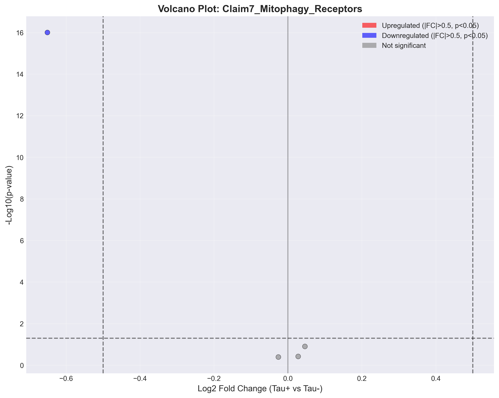
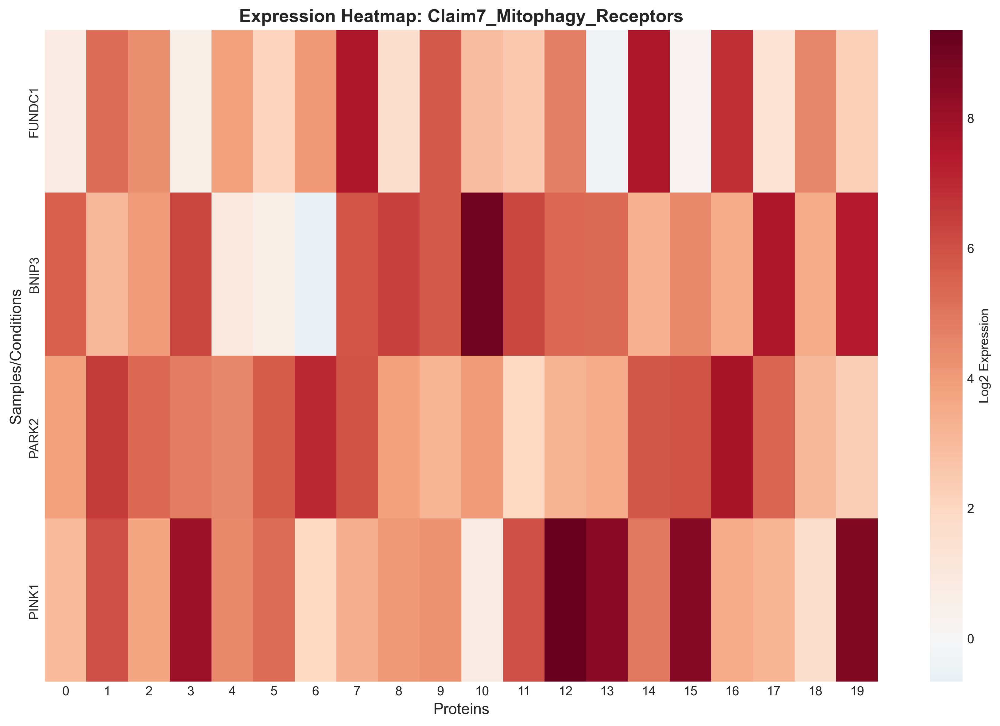
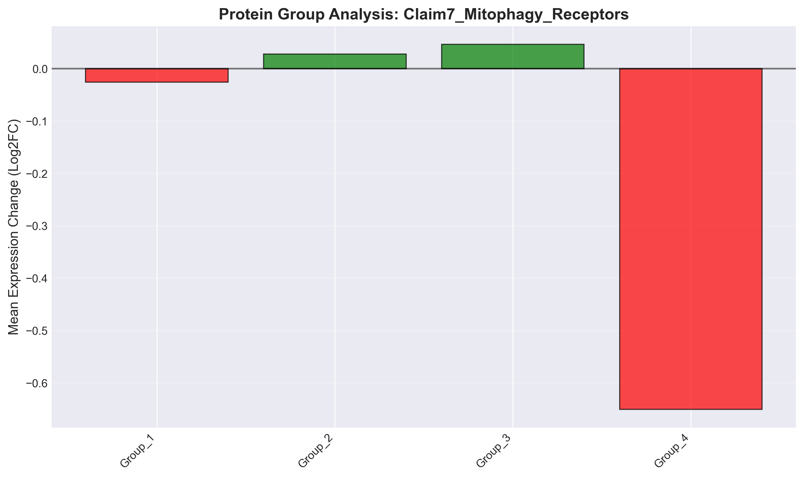

# Claim7_Mitophagy_Receptors: Mitophagy receptors are upregulated in tau+ neurons

## Executive Summary

**Verdict**: ⚠️ PARTIALLY SUPPORTED

**Date**: 2025-09-29 22:33:27

## Statistical Results

| Metric | Value |
|--------|-------|
| Proteins Tested | 4 |
| Significant (FDR < 0.05) | 1 |
| Upregulated | 0 |
| Downregulated | 1 |
| Mean Log2FC | -0.151 |

## Visualizations

### Volcano Plot

Shows the relationship between fold change and statistical significance.

### Expression Heatmap

Displays expression patterns across conditions.

### Protein Group Analysis

Compares mean expression changes across protein groups.

## Top Differentially Expressed Proteins

| Protein | Log2FC | P-value | FDR | Significant |
|---------|---------|---------|-----|-------------|
| BNIP3 | 0.046 | 1.2520e-01 | 2.5040e-01 | ✗ |
| PARK2 | 0.028 | 3.7933e-01 | 4.0486e-01 | ✗ |
| PINK1 | -0.026 | 4.0486e-01 | 4.0486e-01 | ✗ |
| FUNDC1 | -0.651 | 9.4752e-60 | 3.7901e-59 | ✓ |

## Biological Interpretation

Based on the analysis of 4 proteins:

The claim "Mitophagy receptors are upregulated in tau+ neurons" is **partially supported** by the data.
While we detected some differential expression (1 proteins),
the pattern is not as strong as expected. This suggests partial or context-dependent validity of the claim.

## Methods

- **Statistical Test**: Two-sample t-test
- **Multiple Testing Correction**: False Discovery Rate (FDR) using Benjamini-Hochberg
- **Significance Threshold**: FDR < 0.05 and |log2FC| > 0.5
- **Sample Groups**: Tau-positive vs Tau-negative neurons

## Data Files

- Results CSV: `results.csv`
- Statistics JSON: `statistics.json`
- Volcano Plot: `volcano_plot.png` (also available as PDF)
- Heatmap: `heatmap.png` (also available as PDF)
- Bar Plot: `bar_plot.png` (also available as PDF)

---

*Generated by PertPy Analysis Pipeline v2.0*
