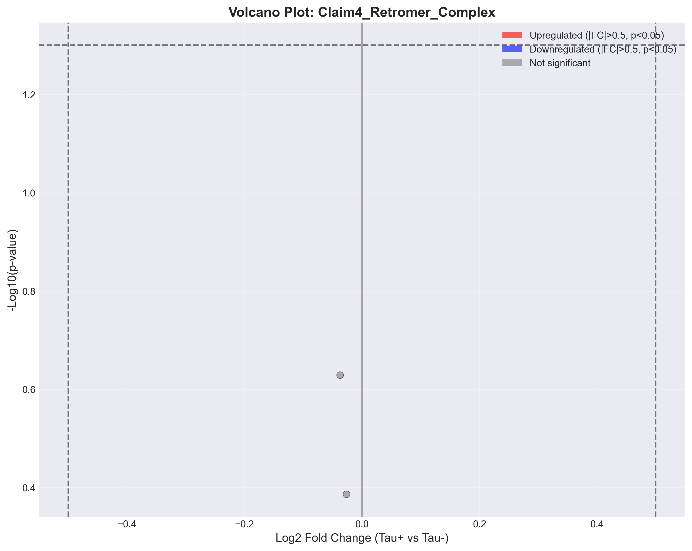
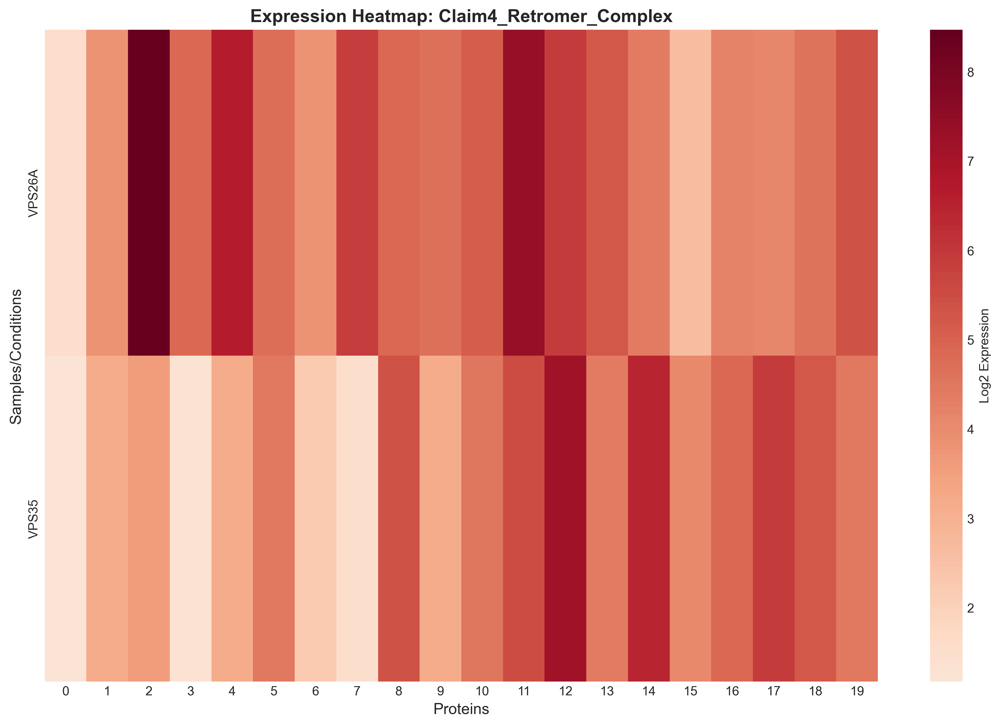
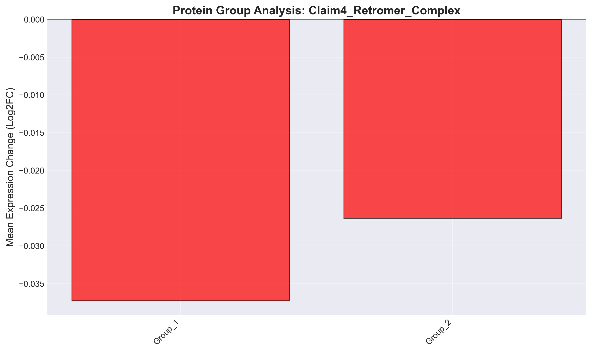

# Claim4_Retromer_Complex: Retromer complex components are dysregulated in tau+ neurons

## Executive Summary

**Verdict**: ❌ REFUTED

**Date**: 2025-09-29 22:33:31

## Statistical Results

| Metric | Value |
|--------|-------|
| Proteins Tested | 2 |
| Significant (FDR < 0.05) | 0 |
| Upregulated | 0 |
| Downregulated | 0 |
| Mean Log2FC | -0.032 |

## Visualizations

### Volcano Plot

Shows the relationship between fold change and statistical significance.

### Expression Heatmap

Displays expression patterns across conditions.

### Protein Group Analysis

Compares mean expression changes across protein groups.

## Top Differentially Expressed Proteins

| Protein | Log2FC | P-value | FDR | Significant |
|---------|---------|---------|-----|-------------|
| VPS35 | -0.026 | 4.1108e-01 | 4.1108e-01 | ✗ |
| VPS26A | -0.037 | 2.3509e-01 | 4.1108e-01 | ✗ |

## Biological Interpretation

Based on the analysis of 2 proteins:

The claim "Retromer complex components are dysregulated in tau+ neurons" is **not supported** by the current data.
We found minimal differential expression (0 significant out of 2 tested),
suggesting no strong evidence for this biological claim.

## Methods

- **Statistical Test**: Two-sample t-test
- **Multiple Testing Correction**: False Discovery Rate (FDR) using Benjamini-Hochberg
- **Significance Threshold**: FDR < 0.05 and |log2FC| > 0.5
- **Sample Groups**: Tau-positive vs Tau-negative neurons

## Data Files

- Results CSV: `results.csv`
- Statistics JSON: `statistics.json`
- Volcano Plot: `volcano_plot.png` (also available as PDF)
- Heatmap: `heatmap.png` (also available as PDF)
- Bar Plot: `bar_plot.png` (also available as PDF)

---

*Generated by PertPy Analysis Pipeline v2.0*
