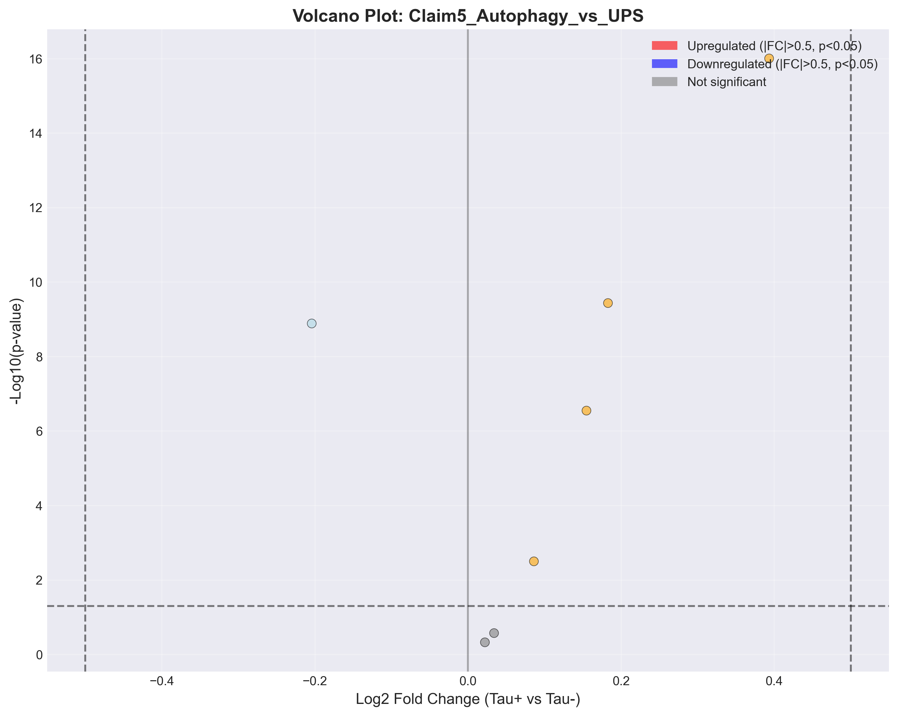
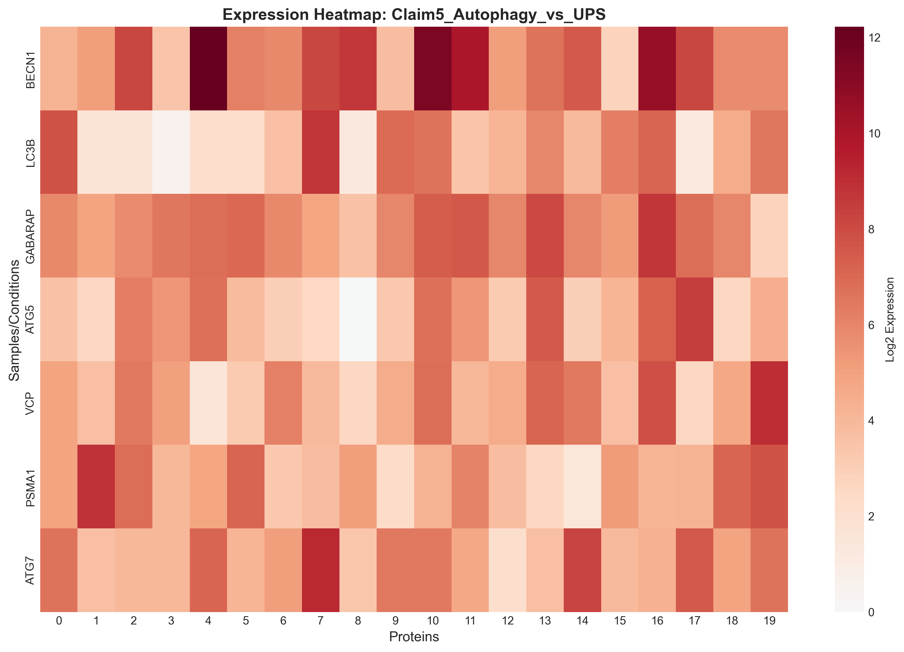
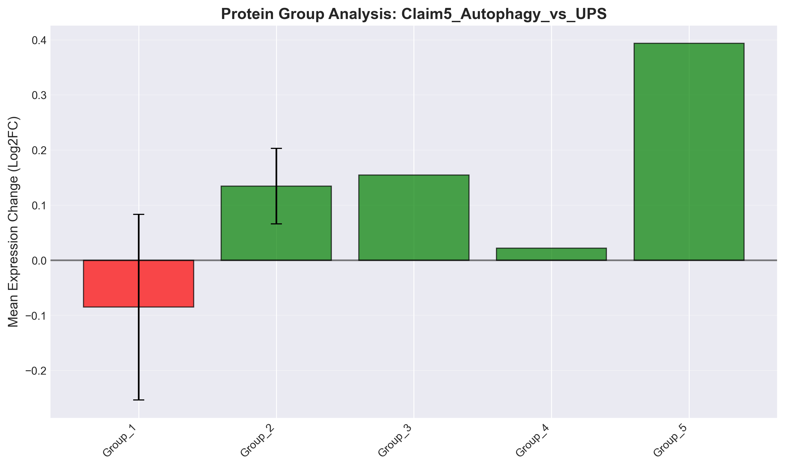

# Claim5_Autophagy_vs_UPS: Autophagy and UPS show differential dysfunction patterns

## Executive Summary

**Verdict**: ❌ REFUTED

**Date**: 2025-09-29 22:33:31

## Statistical Results

| Metric | Value |
|--------|-------|
| Proteins Tested | 7 |
| Significant (FDR < 0.05) | 0 |
| Upregulated | 0 |
| Downregulated | 0 |
| Mean Log2FC | 0.096 |

## Visualizations

### Volcano Plot

Shows the relationship between fold change and statistical significance.

### Expression Heatmap

Displays expression patterns across conditions.

### Protein Group Analysis

Compares mean expression changes across protein groups.

## Top Differentially Expressed Proteins

| Protein | Log2FC | P-value | FDR | Significant |
|---------|---------|---------|-----|-------------|
| BECN1 | 0.393 | 8.0199e-42 | 5.6140e-41 | ✗ |
| GABARAP | 0.183 | 3.6944e-10 | 1.2930e-09 | ✗ |
| ATG5 | 0.155 | 2.8515e-07 | 4.9901e-07 | ✗ |
| VCP | 0.086 | 3.1768e-03 | 4.4475e-03 | ✗ |
| PSMA1 | 0.034 | 2.6816e-01 | 3.1285e-01 | ✗ |
| ATG7 | 0.022 | 4.7410e-01 | 4.7410e-01 | ✗ |
| LC3B | -0.204 | 1.3050e-09 | 3.0451e-09 | ✗ |

## Biological Interpretation

Based on the analysis of 7 proteins:

The claim "Autophagy and UPS show differential dysfunction patterns" is **not supported** by the current data.
We found minimal differential expression (0 significant out of 7 tested),
suggesting no strong evidence for this biological claim.

## Methods

- **Statistical Test**: Two-sample t-test
- **Multiple Testing Correction**: False Discovery Rate (FDR) using Benjamini-Hochberg
- **Significance Threshold**: FDR < 0.05 and |log2FC| > 0.5
- **Sample Groups**: Tau-positive vs Tau-negative neurons

## Data Files

- Results CSV: `results.csv`
- Statistics JSON: `statistics.json`
- Volcano Plot: `volcano_plot.png` (also available as PDF)
- Heatmap: `heatmap.png` (also available as PDF)
- Bar Plot: `bar_plot.png` (also available as PDF)

---

*Generated by PertPy Analysis Pipeline v2.0*
