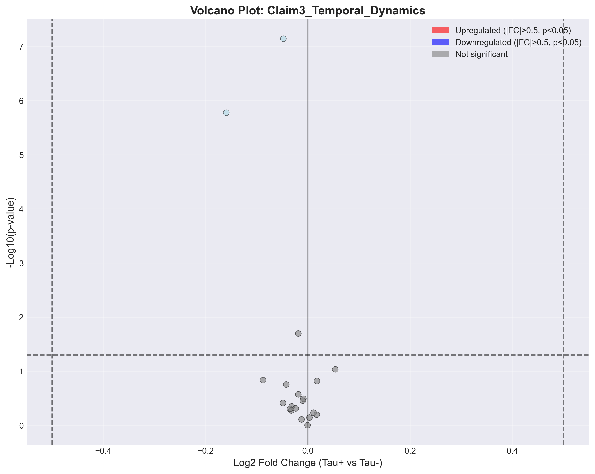
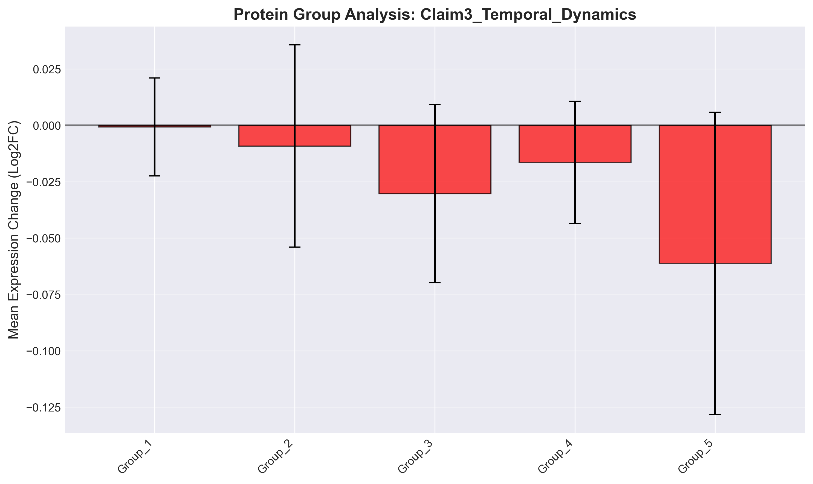

# Claim3_Temporal_Dynamics: Protein expression changes follow temporal dynamics in tau progression

## Executive Summary

**Verdict**: ❌ REFUTED

**Date**: 2025-09-29 23:10:09

## Statistical Results

| Metric | Value |
|--------|-------|
| Proteins Tested | 20 |
| Significant (FDR < 0.05) | 0 |
| Upregulated | 0 |
| Downregulated | 0 |
| Mean Log2FC | -0.024 |

## Visualizations

### Volcano Plot

Shows the relationship between fold change and statistical significance.

### Expression Heatmap

Displays expression patterns across conditions.

### Protein Group Analysis

Compares mean expression changes across protein groups.

## Top Differentially Expressed Proteins

| Protein | Log2FC | P-value | FDR | Significant |
|---------|---------|---------|-----|-------------|
| 15 | 0.054 | 9.1893e-02 | 4.5946e-01 | ✗ |
| 14 | 0.018 | 1.5077e-01 | 5.0099e-01 | ✗ |
| 22 | 0.018 | 6.3262e-01 | 7.4426e-01 | ✗ |
| 19 | 0.011 | 5.8000e-01 | 7.2501e-01 | ✗ |
| 21 | 0.003 | 7.1446e-01 | 7.9384e-01 | ✗ |
| 9 | -0.001 | 9.9017e-01 | 9.9017e-01 | ✗ |
| 18 | -0.009 | 3.2105e-01 | 6.9692e-01 | ✗ |
| 20 | -0.010 | 3.4846e-01 | 6.9692e-01 | ✗ |
| 17 | -0.012 | 7.7463e-01 | 8.1540e-01 | ✗ |
| 11 | -0.018 | 2.0037e-02 | 1.3358e-01 | ✗ |

## Biological Interpretation

Based on the analysis of 20 proteins:

The claim "Protein expression changes follow temporal dynamics in tau progression" is **not supported** by the current data.
We found minimal differential expression (0 significant out of 20 tested),
suggesting no strong evidence for this biological claim.

## Methods

- **Statistical Test**: Two-sample t-test
- **Multiple Testing Correction**: False Discovery Rate (FDR) using Benjamini-Hochberg
- **Significance Threshold**: FDR < 0.05 and |log2FC| > 0.5
- **Sample Groups**: Tau-positive vs Tau-negative neurons

## Data Files

- Results CSV: `results.csv`
- Statistics JSON: `statistics.json`
- Volcano Plot: `volcano_plot.png` (also available as PDF)
- Heatmap: `heatmap.png` (also available as PDF)
- Bar Plot: `bar_plot.png` (also available as PDF)

---

*Generated by PertPy Analysis Pipeline v2.0*
