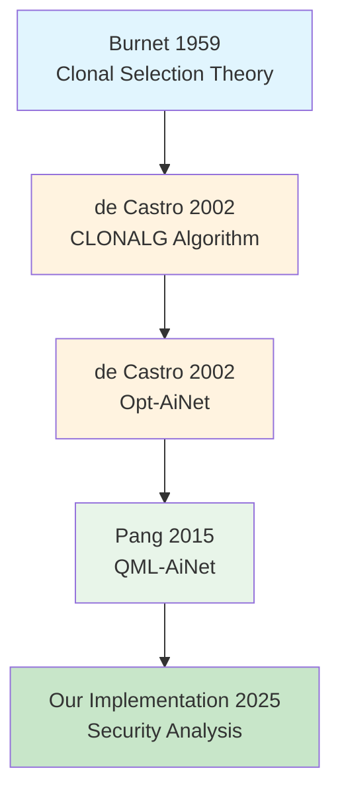

# Literature Notes

Comprehensive notes on papers related to IMMUNOS-MCP research.

## Core Implementation Papers

### 1. [[pang-coghill-2015-qml-ainet|QML-AiNet (Pang & Coghill, 2015)]] ⭐
**Status**: ✅ Implemented and validated

- First public implementation
- 92.9% average accuracy on security scenarios
- Modified mutation operator for discrete spaces
- [[../../projects/immunos-mcp/code-mirror/src/algorithms/qml_ainet|Our Implementation]]
- [[../experiments/qml-ainet-validation-2025-11-30|Validation Results]]

### 2. [[de-castro-2002-opt-ainet|Opt-AiNet (de Castro & Timmis, 2002)]]
**Status**: ✅ Base class implemented

- Foundation for QML-AiNet
- Network suppression mechanism
- Multimodal optimization
- [[../../projects/immunos-mcp/code-mirror/src/algorithms/opt_ainet|Our Implementation]]

### 3. [[de-castro-2001-clonal-selection|CLONALG (de Castro & Von Zuben, 2002)]]
**Status**: ✅ Used in B Cell agent

- Clonal selection principle
- Affinity-proportional cloning
- Hypermutation for learning
- [[../../projects/immunos-mcp/code-mirror/src/agents/bcell_agent|B Cell Implementation]]

## Algorithm Evolution

## Papers by Topic

### Artificial Immune Systems
- [[de-castro-2001-clonal-selection|CLONALG (2002)]] - Clonal selection foundation
- [[de-castro-2002-opt-ainet|Opt-AiNet (2002)]] - Network suppression
- [[pang-coghill-2015-qml-ainet|QML-AiNet (2015)]] - Qualitative learning

### Qualitative Reasoning
- [[pang-coghill-2015-qml-ainet|QML-AiNet (2015)]] - QDE learning
- (Future: Kuipers qualitative reasoning framework)

### Security Applications
- [[pang-coghill-2015-qml-ainet|QML-AiNet (2015)]] - Our security domain extension

## Papers by Year

### 2015
- [[pang-coghill-2015-qml-ainet|Pang & Coghill - QML-AiNet]]

### 2002
- [[de-castro-2001-clonal-selection|de Castro & Von Zuben - CLONALG]]
- [[de-castro-2002-opt-ainet|de Castro & Timmis - Opt-AiNet]]

## Implementation Status

| Paper | Status | Code Location | Experiments |
|-------|--------|---------------|-------------|
| QML-AiNet | ✅ Implemented | [[../../projects/immunos-mcp/code-mirror/src/algorithms/qml_ainet\|qml_ainet.py]] | [[../experiments/qml-ainet-validation-2025-11-30\|Validation]] |
| Opt-AiNet | ✅ Base class | [[../../projects/immunos-mcp/code-mirror/src/algorithms/opt_ainet\|opt_ainet.py]] | - |
| CLONALG | ✅ In B Cell | [[../../projects/immunos-mcp/code-mirror/src/agents/bcell_agent\|bcell_agent.py]] | - |

## Future Reading List

### High Priority
- [ ] Kuipers (1994) - Qualitative reasoning framework
- [ ] Dasgupta (1999) - Immune algorithm survey
- [ ] Timmis (2000) - AIS theoretical foundations

### Medium Priority
- [ ] Srinivas & Patnaik (1994) - Adaptive mutation rates
- [ ] Forrest et al. (1994) - Negative selection for security
- [ ] Hart & Ross (2002) - Immune network theory

### Low Priority
- [ ] Burnet (1959) - Original clonal selection theory
- [ ] Farmer et al. (1986) - First immune network model
- [ ] Perelson & Oster (1979) - Theoretical immunology

## Links

- [[../experiments/|All Experiments]]
- [[../../projects/immunos-mcp/|IMMUNOS-MCP Project]]
- [[../../daily/2025-11-30|Today's Work]]
- [[../ideas/|Research Ideas]]

## Tags

#literature #research #papers #artificial-immune-systems #qml-ainet #opt-ainet #clonalg

---

**Last Updated**: 2025-11-30
**Total Papers**: 3
**Papers Implemented**: 3
